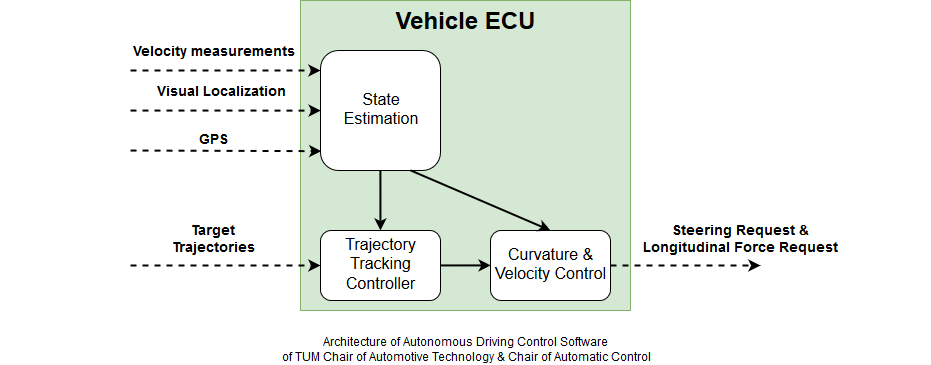

# Autonomous Driving Control Software of TUM Roborace Team
### Overview
This software stack has been developed and used for the Roborace Competition. It achieved 220kph and 95% of the combined lateral and longitudinal acceleration potential of the DevBot. This allowed to drive within 2% of the laptime of an amateuer human race driver. The overall research project is a joint effort of the Chair of Automotive Technology and the Chair of Automatic Control.

This software component covers the trajectory tracking, state estimation and vehicle dynamics control aspects of the stack. It takes trajectories from the planner as the main input and delivers appropriate steering, powertrain and brake commands. Furthermore, it handles vehicle startup and emergency brake situations. The main functional components are depicted in this architecture diagram:

A video of the performance at the Monteblanco track can be found [here](https://www.youtube.com/watch?v=-vqQBuTQhQw). Current updates on the project status and a list of related scientific publications are available [here](https://www.ftm.mw.tum.de/en/main-research/vehicle-dynamics-and-control-systems/roborace-autonomous-motorsport/). If you find this repository useful and base your work upon it, please cite [Minimum curvature trajectory planning and control for an autonomous race car](https://www.tandfonline.com/doi/abs/10.1080/00423114.2019.1631455).

### Disclaimer
This software is provided *as-is* and has not been subject to a certified safety validation. Autonomous Driving is a highly complex and dangerous task. In case you plan to use this software on a vehicle, it is by all means required that you assess the overall safety of your project as a whole. By no means is this software a replacement for a valid safety-concept. See the license for more details.

### People Involved
##### Core Developer
* [Alexander Wischnewski](mailto:alexander.wischnewski@tum.de) (Control, State Estimation, System Components)

##### Acknowledgements
Several students contributed to the success of the project during their Bachelor's, Master's or Project Thesis.
* Fabian Christ (Trajectory Planning)
* Marco Kappertz (State Estimation)
* Johannes Schwarz (Control)
* Madeline Wolz (State Estimation)

The examples for a Vehicle ECU software and a Hardware-in-the-Loop simulation setup have been developed in close collaboration with Speedgoat GmbH. We want especially to acknowledge the work done by
* Timo Strässle

### List of software component in this repository
* `CI`: functionality related to continuous integration jobs.
* `control`: everything that actuates the low level vehicle behavior and therefore acts as a control system, especially curvature, velocity and lateral tracking controller.
* `estimation`: Vehicle dynamics sensor fusion and fusion of different localization pipelines.
* `example_vehicle`: Example implementation of the software for a passenger vehicle.
* `friction`: Friction estimation and tire analysis.
* `interfaces`: Contains interpackage interface definitions.
* `main`: Contains the main module model which collects all subcomponents.
* `misc`: Several small functions, e.g. transformations.
* `network`: Interfaces to other system components, e.g. via CAN or ethernet.
* `scripts`: A collection of useful scripts for operating this module.
* `softwareEmulation`: Replacements used for simulation purposes of the more complex planning parts in the full software stack.
* `system`: Vehicle diagnosis, system startup and state machine logic.
* `tracks`: Example tracks for controller development.

# Installation
This is a brief tutorial how to setup your computer to work on the controller software.

1. Install MATLAB 2018b
2. Create a new folder which will contain the software stack
3. Create subfolders `modules` and `simulation`
4. Checkout the following repositories in the corresponding subfolders on your local machine
    * `modules/mod_vehicle_dynamics_control`
    * `simulation/sim_vehicle_dynamics`
5. Check if you setup everything correctly
    * Go to the `Start Simulation` section below and run a simulation
    * If it runs without errors, your setup is ready to go
    * You can now inspect the results as described below

### Comments on software development infrastructure
Due to the requirement, to manage multiple vehicle with the same code, we use Data Dictionaries and Simulink Project extensively. You can find information on [Simulink Project](https://de.mathworks.com/products/simulink/projects.html) and [Data Dictionaries](https://de.mathworks.com/help/simulink/ug/what-is-a-data-dictionary.html) in the Mathworks Simulink Documentation. As long as you do not plan to restructure the repositories or add multiple vehicles, it is not necessary to dive very deep into these topics. There are high level functions available to help you with software configuration (see Working with the Software Stack section).

# Working with the Software Stack
### Getting started with the simulation enviroment
The repository provides multiple examples to get you started. The first runs on a Desktop computer based and simulates the control software, a vehicle model and a low-fidelity emulation of the trajectory planning software. It can be found under `/example_vehicle/tests/controller_dev/`. A similar framework is available for testing upon a Speedgoat Real-Time Computer. `/example_vehicle/tests/controller_dev_sg/` has two variants of this: One is a loop-back simulation which can be deployed on a single real-time computer with CAN and Ethernet connected as a loop-back. The second aims at deploying the control software and the physics simulation on separate real-time computer and forms a standard Hardware-in-the-Loop setup.

##### Desktop simulation
* Open the main project `modules/mod_vehicle_dynamics_control/Mod_vehicle_dynamics_control.prj`
* Open the model `modules/mod_vehicle_dynamics_control/example_vehicle/tests/controller_dev/controller_dev.slx` in Simulink and run it via the *Run* button.

##### Loop-back simulation
* 1 Speedgoat Real-Time Target Machine required
* Open the main project `modules/mod_vehicle_dynamics_control/Mod_vehicle_dynamics_control.prj`
* Configure the project for Speedgoat deployment using `configureSimBuildModelConfig('Speedgoat');` and `configureVDCBuildModelConfig('Speedgoat');`
* Open the model `modules/mod_vehicle_dynamics_control/example_vehicle/tests/controller_dev_sg/controller_dev_sg.slx` in Simulink and build it via the *Build* button. Now you are ready to load the software on your speedgoat hardware.
* Connect CAN and Ethernet loopbacks to the corresponding interfaces and run the speedgoat model from the MATLAB command line.

##### Hardware-in-the-Loop simulation
* 2 Speedgoat Real-Time Target Machines required
* Open the main project `modules/mod_vehicle_dynamics_control/Mod_vehicle_dynamics_control.prj`
* Configure the project for Speedgoat deployment using `configureSimBuildModelConfig('Speedgoat');` and `configureVDCBuildModelConfig('Speedgoat');`
* Open the model `modules/mod_vehicle_dynamics_control/example_vehicle/tests/controller_dev_sg/controller_dev_sg_RCP.slx` in Simulink, build it via the *Build* button and load it onto the real-time computer which is your ECU.
* Open the model `modules/mod_vehicle_dynamics_control/example_vehicle/tests/controller_dev_sg/controller_dev_sg_HIL.slx` in Simulink, build it via the *Build* button and load it onto the real-time computer which is your physics simulation.
* Connect CAN and Ethernet to the corresponding interfaces and run both speedgoat model from the MATLAB command line.

##### Choice of vehicle dynamics model
All the above variants can be used with one of three different vehicle dynamic models. They are chosen based on the parameter `P_PassengerVehicleSimModel` located in `example_vehicle/datadict/PassengerVehicle.sldd`. Details on the variants are available in the documentation of the `sim_vehicle_dynamics` repository. The parameter can be set as follows:
* Nonlinear single track model (recommended for basic development tasks, low computation times) `P_PassengerVehicleSimModel = 1`
* Customized nonlinear dual track model for racing applications based on the Mathworks [Vehicle Dynamics Blockset](https://de.mathworks.com/products/vehicle-dynamics.html) `P_PassengerVehicleSimModel = 2`
* Standard nonlinear dual track model from the examples of the Mathworks [Vehicle Dynamics Blockset](https://de.mathworks.com/products/vehicle-dynamics.html) `P_PassengerVehicleSimModel = 3`

### Use Different Tracks
##### Load a racetrack
The racelines available for simulation can be found under `tracks`. Each data dictionary represents a single raceline and the corresponding scenario information (e.g. vehicle start position). To load a new scenario, do the following:
* Call `loadScenario('<YourScenarioName>')`. The scenario name has to be written without a .sldd, e.g. `loadScenario('Modena')`

##### Create new racetracks
Racetracks can be imported via .csv files using `scripts/CreateNewTrack.m`. The format specification can be found in the function documentation of the file. An example is provided in `tracks/TrackCreationExample.csv`. Run the script to create a new track definition in the tracks folder. This can be imported via loadScenario afterwards.
* Call `CreateNewTrack('<csvfile>', 3)` to import the csv and create a racetrack

### Data Inspection
##### Create debug logs
* Run `convertSimLogs(logsout, '<YOURFILENAME>.mat')` with a file name of your choice
* Load the .mat while which you have just created
* Inspect the structure `debug`

##### Use the Data Inspection Tool
The software stack provides a MATLAB GUI for basic visualization of all important data for the algorithms. It can be started by running `trajectorycontrolvisualizer` from the MATLAB command line. A general introduction to the usage of the tool can be found in `scripts/ControlVisualizer/Readme.md`. Details on the signal meanings are documented in the models.

# Adapt the Software Stack to your vehicle
In the following, you find a guide how to modify the example vehicle such that it corresponds to your own vehicle. The software is currently in use with Speedgoat hardware in the project, however it should be straight-forward to use it on other targets which support a Simulink Toolchain. The guide covers the functional changes necessary and gives a starting point which signals have to be used. The software stack is run by the Roborace Team of the TUM in an autonomous racing car. It aims at being developed independent from the specific use -case, however, development focus is high-performance driving. Therefore, some changes might be required depending on your vehicle configuration.

In general, it is recommended to modify the example vehicle. The only case where it is necessary to add a new vehicle is if you have to maintain multiple vehicle configurations or want to contribute to the upstream development. Please have in mind, that every vehicle has a two character identifier, which is used extensively throughout the project. In the case of this example vehicle it is `pa`. You will find this in front of many file names in this tutorials. All of these files are vehicle specific and may be subject to reconfiguration in a multiple vehicle setup.

The example vehicle is provided with two main models. The first, the simulation model (`example_vehicle/tests/controller_dev/controller_dev.slx`), is intended to test the functionality of the Vehicle ECU code with a vehicle which is parametrized very similiar to your vehicle on your computer using Simulink. The second (`example_vehicle/models/VehicleECU.slx`), is a basis for creating the model with the hardware interfaces of your ECU to generate code. It contains all necessary interfaces which have to be connected according to your vehicle configuration. Details on this process can be found in the section below.

The workflow to adapt the software to your vehicle has three steps:
1. Adjust vehicle parameters for simulation and control software
2. Tune controllers to fit your needs in the simulation
3. Add vehicle specific interfaces to the target software

### General advice on setting up a prototype with this software stack (Hardware & Interfaces)
The main software interfaces are the trajectory planner and the vehicle actuators. In the Robrace project we based the former on an Ethernet link, the latter is using a Controller Area Network (CAN) interface. The hardware implementation of those interfaces may change depending on your prototype. However, all signals are expected to come at a fast update rate (~100Hz) for all low-level sensors and a moderate update rate (~10-20Hz) for localization sources. Slower sample rates could cause performance degradation. Trajectory updates are required also at an moderate update rate (~10-20Hz). Another point to be stressed is that the controller design requires high-quality derivative information for the target trajectory. It performs safety checks on those signals and they are used directly in the controller. Noisy derivatives can significantly degrade performance and even affect vehicle stability. Note that the controller requires two distinct trajectories, the performance trajectory (standard) as well as the emergency trajectory. The latter is required to always come to a full-stop and provide a backup in case of network failure or a fault in the planning software.  

Depending on the vehicle configuration, the actuator interface might differ significantly. As the controller requests a longitudinal force, it is required to map that to the corresponding actuator requests (e.g. combustion engine, electric motor(s) or hydraulic brakes) to achieve the requested value. Please note that the software expects the request to be conducted without delay. Especially for combustion engines, this might not be true and require additional modifications. Experience has shown that the lateral control performance depends heavily on the steering actuator response. Again, the controller does not compensate for response delay or low-pass characteristics. We have seen good performance when the requested steering angle is tracked with a low-pass time-constant of roughly 50ms. In case your hardware does not match these requirements, modifications in the lateral controller design might be necessarry.

From a sensors perspective, the minimum requirement is one IMU sensor (providing at least longitudinal and lateral acceleration and yaw rate) and one localization measurement. Furthermore, using wheel speed sensors is strongly recommended, even though they are mainly used for anti-wheel-lock control. Adding a velocity sensor is optional, as the required information can be estimated based upon localization measurements and IMU signals. The software provides inputs for two localization measurements, two velocity measurements and two IMU measurements. Automatic failure detection is performed for the velocity measurements, however, online reconfiguration for all six sensors is possible (maintaining the minimum configuration mentioned above). This allows you to feed additional diagnostics and quality information into the sensor fusion.

### Adjust the vehicle parameters
The vehicle parameters are located in two different sources. The reason for this is that it should be possible to simulate parameter mismatch between the model and the software by applying different vehicle parameter for the simulation model than in the software.

The control software vehicle parameters must be adjusted in `modules/mod_vehicle_dynamics_control/parameters/vehicle/pa_vehicleparameter.sldd`. A description of the parameters can be found under `modules/mod_vehicle_dynamics_control/parameters/vehicle/Readme.md`.

The simulation vehicle parameters must be adjusted in `simulation/sim_vehicle_dynamics/parameters/pa_sim_vehicleparameter.sldd`. A description of the parameters can be found in the related documentation.

### Tune controllers
There are three components which definitly require tuning to your vehicle. You can find the detailed tuning guides here:  
* State Estimation: `modules/mod_vehicle_dynamics_control/estimation/Readme.md`
* Motion Control: `modules/mod_vehicle_dynamics_control/control/Readme.md`
* System & Diagnosis: `modules/mod_vehicle_dynamics_control/system/Readme.md`

In general, we recommend to use our graphical debug tool to adjust the parameters of the algorithms. Please see the *Working with the Software Stack* section for an introduction.

### Adjust vehicle specific interfaces
Open the vehicle ECU model `modules/mod_vehicle_dynamics_control/example_vehicle/models/VehicleECU.slx`. This is your main model which can be used to flash your ECU. It is already partitioned in a *Receive*, *Software* and *Send* part. You have already done the necessary changes to *Software* if you have adjusted all controllers as described above. We will work through the other sections step by step.

##### Receive Parts:
The most important thing comes first: The **TrajectoryPlanning** Interface. This is the core of your communication with the controller. It must be filled with trajectories which are then realized by the controller. They can be send asynchronously, however if the vehicle reaches the end of the current trajectory it goes to a hard emergency brake. The frequency to provide new trajectories is therefore determined by the length and speed profile of the trajectories. Each trajectory *must* have 50 discretization points, due to limitations in code generation for variable sized signals. However, the spatial spacing between the points is arbitrary and can also be variable within a single trajectory.

In general, there are two possiblities: Either you supply a trajectory with all derivative information (acceleration and curvature) or you have to configure the controller to do that (see controller tuning section). In this case, you can provide zeros to these signals.

The software distinguishes between a *Performance Trajectory* and a *Emergency Trajectory*. Both have to be provided by the planner. Under normal circumstances, the *Performance Trajectory* is driven. The *Emergency Trajectory* is used for soft emergency cases, where the vehicle brakes at fast as possible but path tracking is still enabled. This can be used for system failures not directly related to steering or powertrain, e.g. Battery or Temperature Problems, or just to stop the vehicle before it reaches the mission finished command. A detailed descprition of the signals provided for the trajectories, can be found in `modules/mod_vehicle_dynamics_control/interfaces/Readme.md`.

It is necessary to signalize the controller that the trajectory planner and mission planner are active. This is done via setting `Trajectories_CommsStatus` and `Strategy_CommsStatus` to `TUMHealthStatus.OK`. In case they loose communication, they should be set to `TUMHealthStatus.ERROR`. This triggers a soft emergency brake. Furthermore, the mission planner has to signal to the controller that it wants to start the mission via setting `Strategy_Status` to `TUMStrategyState.S_DRIVING_NORMAL`. Again, its possible to trigger an emergency brake via setting the status to `TUMStrategyState.S_DRIVING_EMERGENCY`. All these signals *must* be included in your architecture for the controller to function properly. A reference implementation can be found in the simulation model.

The **VehicleSensorData** bus is the second crucial interface to the controller. A description of what signals are expected can be found in `modules/mod_vehicle_dynamics_control/interfaces/Readme.md`. An example for how to run the software can be found in the implementation of the simulation in `modules/mod_vehicle_dynamics_control/example_vehicle/tests/controller_dev/controller_dev.slx`. It is possible to use the controller with less signals than this, however it is recommended to calculate 'replacement' signals, e.g. the longitudinal velocity based on the wheelspeeds and the lateral velocity from a steady-state assumption.

The **VehicleSystemStatus** controls the startup process of the vehicle. Set the `Hardware` signal to `TUMHealthStatus.OK` if all devices are powered up and the system is ready to be used. Set `AIDriver` to the same value if all startup conditions from the Autonomous System are met, e.g. localization available or data logging activated. `ParkBrakeApplied_b` gives feedback to the controller whether a low-level park brake system is still applied. If this is not available, set it to false. Finally, `VehicleReady2Drive` indicates that the vehicle has given control to the control unit. This means that the controller expects steering and powertrain to respond immediatly to commands. This signal is used as a condition to go to internal driving state.

Finally, **ActuatorLimiations** tells the controller what are the current maximum and minimum control values for steering angle at the wheels and the overall powertrain force. These can also be set dynamically and prevent the controller from requesting values which cannot be used. This helps to prevent wind-up of the control outputs.

##### Send Parts:
The send subsystem shows a possible implementation of the output processing. `EnableControlOutputs` and `EnableHardEmergencyBrake` provide additional safety mechanisms, to ensure the vehicle never starts driving before the state machine allows and applies the brakes in case that a hard emergency brake is requested. The negative force value for the hard emergency brake should be adjusted to your vehicle. It is recommended to have a value corresponding to -0.6 to -1g. The signal `RequestControl` can be used to signalize a lower level control unit that the motion controller wants to take control over the actuators. Usually, the lower level control unit responds to this request with the `VehicleReady2Drive` signal mentioned earlier in the VehicleSystemStatus.

The controller requests a steering angle at the wheel via `RequestSteeringAngle_rad`. It is assumed that this is the mean of both front wheels. This signal should be send to the steering actuator. The powertrain force is requested via `RequestLongForce_N`. It is assumed to be the sum of the forces acting upon the vehicle in longitudinal direction. These requests must be split according to the motor and brake configuration and can vary between several vehicles. Furthermore, it is possible to utilize a park brake via `ParkBrakeActive`. The controller state machine handles release and locking properly, to be able to start the vehicle on inclined roads.

Finally, it is recommended to use the `Debug` bus provided by the software to inspect whats going on. The simulation model is already configured to log these signals and the description how to convert them to a usable format is given in the section *Working with the Software Stack*. If you want to use the same data analysis workflow on your vehicle, you can implement a similar conversion script for your ECU logs.

##### Model Configuration:
Simulink requires to specify the Target Hardware in the modelconfig. The project uses a quite complex structure to maintain these modelconfigs. This emerged from the need to support mulitple targets with the same code and very different configs. The configs are located in `modules/mod_vehicle_dynamics_control/interfaces/modelconfig.sldd`. The standard config used for the passenger vehicle repository is called `GRT`. Adjust the configuration according to your needs, e.g. Target Hardware and save everything. It is required to reload the project to apply the changes to all models.
