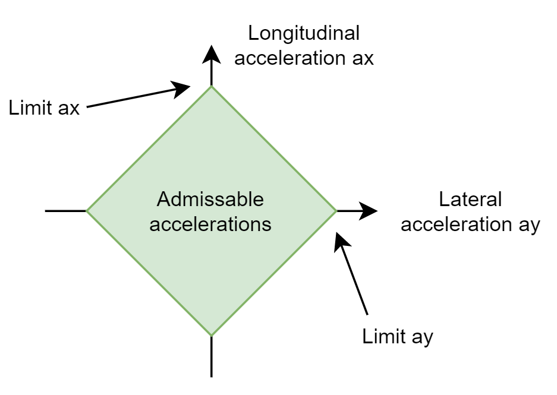

========================
Path Matching
========================

Concept
========================
The path (or trajectory) matching component is responsible for safety checks based on the target trajectory and calculation of the vehicle position in a path-centered coordinate frame. This calculation is done via a closest point search (`localTrajectoryMatching.m`).

Safety checks
========================
The software employs multiple safety checks:

* The lateral deviation from the path and the heading deviation have to be within certain bounds
* The target trajectory has to respect the dynamic limits (combined acceleration constraints)
* The emergency trajectory has to respect the dynamic limits as well as ending close to zero velocities
* Both trajectories are required to be updated with sufficient frequency

The dynamic limits are calculated based on a diamond-shape (standard setting) constraint as depicted in the figure below:

Details on the computation of those constraints can be found in `checkTrajectory.m`.

.. warning::
  All safety checks apply during startup as well as during driving. If these criteria are not met, the vehicle either does not start driving or switches to emergency mode.

Tuning
========================

In the following, the basic tuning process is described for all algorithms in this component. Take care that some data dictionaries have vehicle specific version. This is always named e.g. `db_xxxxxxxx.sldd`. If you change a parameter, you have to do it in the vehicle specific version. This is configured before simulation or building the model automatically by the vehicle project.

Path Matching: `xx_mvdc_path_matching.sldd`:
---------------------------------------------
The most step in the setup of this algorithm is the correct parametrization of the safety checks. `P_VDC_ActivateHighPathDeviationDetection_b` activates the checks path deviation checks. `P_VDC_LateralPathDeviationMax_m` describes the maximum allowed lateral path deviation and `P_VDC_HeadingPathDeviationMax_rad` the maximum allowed heading deviation. The parametrization of the dynamic limit safety checks is done via `P_VDC_axSafetyChecks_mps2` and `P_VDC_aySafetyChecks_mps2`.

If only cartesian coordinates and a velocity profile is provided to the controller, `P_VDC_LocalFFCalculationActive_b` must be set to true. This triggers local calculation of the required feedforward information about the path based on numeric derivatives.

Parameter list `xx_mvdc_path_matching`
============================

This list only serves as a brief description, see the code and the documentation therein for details.

+---------------------------------------+-------------------------------------------------------------------------------------------------+
| Parameter                             | Description                                                                                     |
+=======================================+=================================================================================================+
| P_VDC_LateralPathDeviationMax_m       | Maximum admissable lateral path deviation                                                       |
+---------------------------------------+-------------------------------------------------------------------------------------------------+
| P_VDC_HeadingPathDeviationMax_rad     | Maximum admissable heading path deviation                                                       |
+---------------------------------------+-------------------------------------------------------------------------------------------------+
| P_VDC_PathMatchingTimeOut             | Maximum admissable time until a new trajectory is expected                                      |
+---------------------------------------+-------------------------------------------------------------------------------------------------+
| P_VDC_CurvatureForesight_s            | Foresight time for readout of actual trajectory curvature                                       |
+---------------------------------------+-------------------------------------------------------------------------------------------------+
| P_VDC_PowertrainForesight_s           | Foresight time for readout of actual trajectory longitudinal acceleration                       |
+---------------------------------------+-------------------------------------------------------------------------------------------------+
| P_VDC_LocalFFCalculationActive_b      | Recalculate target trajectory accelerations and curvature based on path and velocity profile    |
+---------------------------------------+-------------------------------------------------------------------------------------------------+
