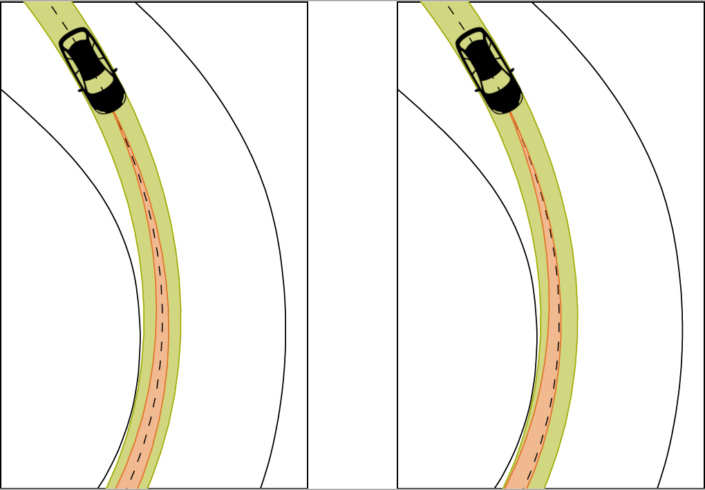
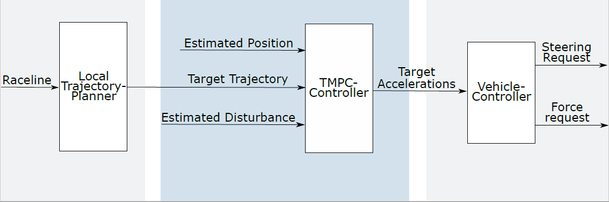

.. _TMPC:
========================
Tube-MPC
========================

Concept
========================
Tube-MPC (TMPC) is an advanced control concept that combines the strengths of model predictive control with the thorough treatment of uncertainty knowledge from robust control. The prediction for the system dynamics applied within an MPC is replaced via the prediction of an uncertain tube which contains all possible realizations of the states and inputs. To calculate this, it needs the system model as well as an uncertainty model. We further implement two different concepts (see figure below): a classical tracking control (left) and a controller which aims at maximizing the resulting vehicle speed under certain constraints imposed by the trajectory planning (right):

The figure depicts the vehicle, the admissible driving space (green), the target trajectory (dashed black) and the prediction of the system dynamics as a tube (orange).

It is roughly divided into two separate parts, the Tube-MPC itself and the underlying acceleration controllers. The former assumes that it can directly actuate the vehicle longitudinal and lateral accelerations while the latter ensures that those are tracked appropriately. The TMPC is responsible for ensuring that the tire acceleration constraints and the lateral deviation constraints are respected. A block diagram of this architecture is depicted below:

Background literature
===============================
If you want to get started with the concept of Tube-MPC and gain a general understanding, the following publications will be helpful:

* **Model Predictive Control: Theory and Design** by *James B. Rawlings, David Q. Mayne and Moritz Diehl** gives a good overview about the general concepts of MPC and its numerical foundations
* **Constrained model predictive control: Stability and optimality** by *D. Q. Mayne, J. B. Rawlings , C. V. Rao, P. O. M. Scokaert* is a good introduction to the understanding of constrained MPC and its difficulties
* **Robust model predictive control of constrained linear systems with bounded disturbances** by *D. Q. Mayne, M. M. Seron and S. V. Raković* introduces one of the fundamental TMPC concepts for linear systems
* **Systems with persistent disturbances: Predictive control with restricted constraints** by *Luigi Chisci, John A Rossiter and G. Zappa* introduces another fundamental TMPC concept for linear systems.

This implementation builds upon the concept presented in the last paper mentioned above.

Overview of the implementation
================================
The TMPC is implemented in the Simulink Model `mvdc_mpc.slx`. It is split into the actual TMPC and the underlying acceleration controllers. The following sections will describe both on a conceptual level as well as providing a basic tuning guide. Please refer to the implementation and :ref:`publications-tmpc` for more details.

The parameters of the TMPC are only partially determined manually within the corresponding data dictionary. A lot of them can be defined via the data structure *sys* (also located in the data dictionary) which can be created from the script *setupTMPCStruct.m*. There you will find many things such as the system description and the cost function tuning. It is not possible to change those values after the controller has been built to improve the computational efficiency.

Numerical implementation
==========================

The optimization problem is formulated as a QP with cost terms constructed from:

* cost for state deviations
* cost for input deviations
* regularization cost for change of longitudinal and lateral accelerations
* penalty cost for slacks

The optimization variables are structured as follows:

[control inputs, slacks]

delta_ax0, delta_ay0, delta_ax1, delta_ay1, ..., slack_constraint1_0, slack_constraint2_0, slack_constraint3_0, ...

Debugging
===========
Despite the general debugging tools for the full control software, there are two additional tools for analysis of the TMPC performance. The `mpcanalyzer` allows you to overlay the predictions of the TMPC with the actual vehicle behavior and scroll through the log. It can be called via typing `mpcanalyzer` in the command line. The `recoverScenario.m` function allows to solve a specific optimization problem reconstructed from the logs again and compare the solutions with the logged solution. This can help in identifying issues with solver tuning. See the header of the script for instructions how to call it.

.. _osqp-library-build:

Build instructions for OSQP libraries
=======================================
The library has to be built for multiple target systems using cmake. Please be sure that cmake was added to the system path during installation. In oder to for the following commands to work, navigate to the OSQP repository first and use PowerShell or cmd for the following commands.  The build artifacts have to be copied to `mod_control/misc/osqp/lib`. General instructions for downloading and building OSQP can be found in the `documentation <https://osqp.org/docs/get_started/sources.html>`_.

MinGW Desktop Simulation (MATLAB):

  .. code-block::

    mkdir build
    cd build
    cmake -G "MinGW Makefiles" ..
    cmake --build .

Visual Studio Desktop Simulation (MATLAB):

  .. code-block::

    mkdir build
    cd build
    cmake -G "Visual Studio 15 2017" -A x64 .. -DCMAKE_BUILD_TYPE=Release
    cmake --build .

gcc Desktop (ROS2 integration):

  .. code-block::

    mkdir build
    cd build
    cmake ..
    make install

The file libosqp.a from '/osqp/build/out' has to be copied to 'mod_control/misc/osqp/lib' and renamed into the following. The project accepts the listed namings:

* libosqp_mingw.lib for MinGW (instead of the standard libosqp.a chosen by cmake)
* libosqp_vs_x64.lib for Visual Studio  (instead of the standard libosqp.lib chosen by cmake)
* libosqp.a for gcc desktop 

Vehicle acceleration controllers
=================================
The acceleration controllers are built upon a classical two-degree of freedom structure. It is based on the idea that there are high-nonlinearities within the vehicle behavior which have to be compensated by a low-level feedback control loop. This is possible since both, the lateral and the longitudinal dynamics, can be approximated by low order systems which are mainly dominated by their static nonlinearities (at least in the stable region of vehicle operation).

The lateral controller takes the target lateral acceleration as an input and outputs a target steering wheel angle. It is formed from three parts:

* A neutral-steer feedforward term calculated from the target acceleration and the current velocity
* A proportional feedback term calculated from the lateral acceleration tracking error obtained from a comparison of the target acceleration and the acceleration measured via the IMU
* An integral feedback term with a limiting term to prevent windup based on the lateral acceleration tracking error

The longitudinal controller takes the target longitudinal acceleration as an input and outputs a target traction force. It is formed from three parts:

* A feedfoward term to realize the force required to obtain the target acceleration (Newtons Law)
* A feedforward term for the aerodynamic driving resistances
* A proportional feedback term calculated from the longitudinal acceleration tracking error obtained from a comparison of the target acceleration and the acceleration measured via the IMU

The performance of these controllers can be inspected at the **TMPCAccControl** page in the :doc:`../../start/debugtool`.

Tuning
========================

In the following, the basic tuning process is described for all algorithms in this component. Take care that some data dictionaries have vehicle specific version. This is always named e.g. `db_xxxxxxxx.sldd`. If you change a parameter, you have to do it in the vehicle specific version. This is configured before simulation or building the model automatically by the vehicle project.

Parameter list `xx_mvdc_mpc`
============================

This list only serves as a brief description, see the code and the documentation therein for details.

+-------------------------------------+----------------------------------------------------------------------------------------+
| Parameter                           | Description                                                                            |
+=====================================+========================================================================================+
| P_VDC_Dist_ax_perc                  | Upper bound on longitudinal disturbance                                                |
+-------------------------------------+----------------------------------------------------------------------------------------+
| P_VDC_Dist_ay_perc                  | Upper bound on lateral disturbance                                                     |
+-------------------------------------+----------------------------------------------------------------------------------------+
| P_VDC_DyLim                         | Maximum allowed lateral deviation                                                      |
+-------------------------------------+----------------------------------------------------------------------------------------+
| P_VDC_EnableTubeMPC                 | Enables calculation of the TMPC controller                                             |
+-------------------------------------+----------------------------------------------------------------------------------------+
| P_VDC_LatAccKp                      | Lateral acceleration feedback controller proportional gain                             |
+-------------------------------------+----------------------------------------------------------------------------------------+
| P_VDC_LogTubeData                   | Enables additional logging of the calculated tubes                                     |
+-------------------------------------+----------------------------------------------------------------------------------------+
| P_VDC_LongAccKp                     | Longitudinal acceleration feedback controller proportional gain                        |
+-------------------------------------+----------------------------------------------------------------------------------------+
| P_VDC_SQPRTI_alpha                  | Adaption speed for subsequent SQP iterations of RTI scheme (between 0 and 1)           |
+-------------------------------------+----------------------------------------------------------------------------------------+
| P_VDC_MaxSpeedTMPC_mps              | Upper speed for learning of US characteristic                                          |
+-------------------------------------+----------------------------------------------------------------------------------------+
| P_VDC_SlowControlSpeedTMPC_mps      | Lower limit for gain-scheduling of lateral acceleration controller                     |
+-------------------------------------+----------------------------------------------------------------------------------------+

Parameter list `setupTMPCStruct.m`
============================

This list only serves as a brief description, see the code and the documentation therein for details.

+-------------------------------------+----------------------------------------------------------------------------------------+
| Parameter                           | Description                                                                            |
+=====================================+========================================================================================+
| sys.reoptimization                  | Allows the TMPC to deviate from the target path and exploit the drivable space         |
+-------------------------------------+----------------------------------------------------------------------------------------+
| sys.use_slack                       | Enable slack variables on all constraints                                              |
+-------------------------------------+----------------------------------------------------------------------------------------+
| sys.Q                               | State deviation weight matrix                                                          |
+-------------------------------------+----------------------------------------------------------------------------------------+
| sys.roh_u                           | Weight for input constraint slacks                                                     |
+-------------------------------------+----------------------------------------------------------------------------------------+
| sys.roh_x                           | Weight for state constraint slacks                                                     |
+-------------------------------------+----------------------------------------------------------------------------------------+
| sys.roh_lin                         | Linear slack penalty factor                                                            |
+-------------------------------------+----------------------------------------------------------------------------------------+
| sys.roh_quad                        | Quadratic slack penalty factor                                                         |
+-------------------------------------+----------------------------------------------------------------------------------------+
| sys.rdiff_ax                        | Weight for change rate in longitudinal acceleration                                    |
+-------------------------------------+----------------------------------------------------------------------------------------+
| sys.rdiff_ay                        | Weight for change rate in lateral acceleration                                         |
+-------------------------------------+----------------------------------------------------------------------------------------+
| sys.N_hor                           | Number of discretization points in horizon                                             |
+-------------------------------------+----------------------------------------------------------------------------------------+
| sys.Ts                              | Sample rate for discretization                                                         |
+-------------------------------------+----------------------------------------------------------------------------------------+

.. _publications-tmpc:

Scientific publications
========================

Details on the presented control algorithms can be found in the following publications:

.. code-block:: none

  @article{Wischnewski2021,
    doi = {10.1080/00423114.2021.1943461},
    url = {https://doi.org/10.1080/00423114.2021.1943461},
    year = {2021},
    month = jun,
    publisher = {Informa {UK} Limited},
    pages = {1--23},
    author = {A. Wischnewski and M. Euler and S. G\"{u}m\"{u}s and B. Lohmann},
    title = {Tube model predictive control for an autonomous race car},
    journal = {Vehicle System Dynamics}
  }
